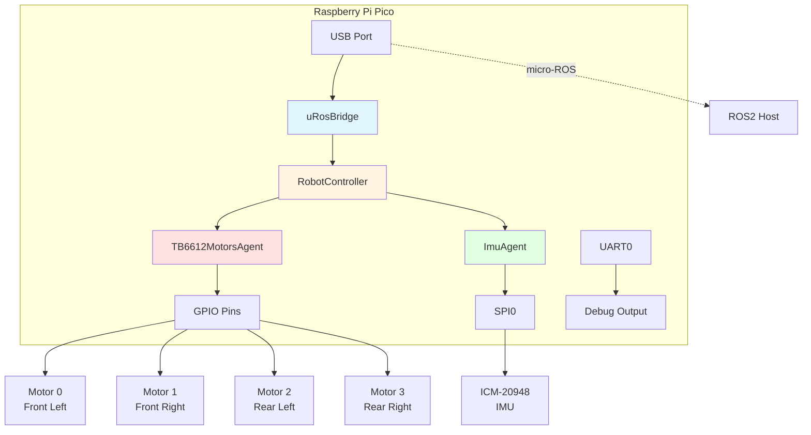
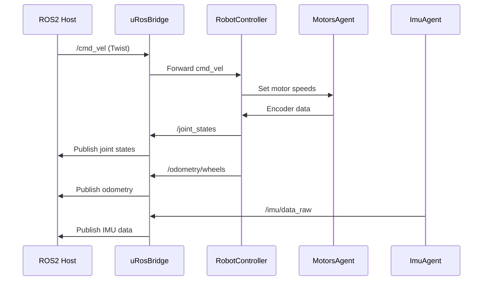

# my_steel Robot Firmware

[](https://github.com/goldjunge91/robot_firmware/actions/workflows/build.yml)
[](https://github.com/goldjunge91/robot_firmware/actions/workflows/test.yml)
[](https://github.com/goldjunge91/robot_firmware/actions/workflows/firmware_release.yml)

Raspberry Pi Pico firmware for mecanum-wheeled robot with motor control, sensor integration, and micro-ROS communication.

## Architecture

Agent-based architecture on FreeRTOS:

- **uRosBridge**: micro-ROS communication over USB
- **TB6612MotorsAgent**: PID motor control with encoder feedback (4 mecanum wheels)
- **ImuAgent**: ICM-20948 IMU via SPI
- **RobotController**: Odometry, cmd_vel, mecanum kinematics
- **BlinkAgent**: LED status

## Hardware

### System Architecture



### ROS Communication Flow



### Pin Mapping

| Component | Pin | Function | Notes |
|-----------|-----|----------|-------|
| **Motor 0 (Front Left)** |
| IN1 | GP2 | Direction control | TB6612 driver |
| IN2 | GP3 | Direction control | TB6612 driver |
| PWM | GP4 | Speed control | 20kHz PWM |
| Encoder A | GP5 | Quadrature encoder | Interrupt-driven |
| Encoder B | GP6 | Quadrature encoder | Interrupt-driven |
| **Motor 1 (Front Right)** |
| IN1 | GP7 | Direction control | TB6612 driver |
| IN2 | GP8 | Direction control | TB6612 driver |
| PWM | GP9 | Speed control | 20kHz PWM |
| Encoder A | GP10 | Quadrature encoder | Interrupt-driven |
| Encoder B | GP11 | Quadrature encoder | Interrupt-driven |
| **Motor 2 (Rear Left)** |
| IN1 | GP12 | Direction control | TB6612 driver |
| IN2 | GP13 | Direction control | TB6612 driver |
| PWM | GP14 | Speed control | 20kHz PWM |
| Encoder A | GP15 | Quadrature encoder | Interrupt-driven |
| Encoder B | GP20 | Quadrature encoder | Interrupt-driven |
| **Motor 3 (Rear Right)** |
| IN1 | GP21 | Direction control | TB6612 driver |
| IN2 | GP22 | Direction control | TB6612 driver |
| PWM | GP23 | Speed control | 20kHz PWM |
| Encoder A | GP24 | Quadrature encoder | Interrupt-driven |
| Encoder B | GP26 | Quadrature encoder | Interrupt-driven |
| **IMU (ICM-20948)** |
| MISO | GP16 | SPI data in | SPI0 @ 1MHz |
| CS | GP17 | Chip select | Active low |
| SCK | GP18 | SPI clock | SPI0 |
| MOSI | GP19 | SPI data out | SPI0 |
| **Debug** |
| TX | GP0 | UART transmit | 115200 baud |
| RX | GP1 | UART receive | 115200 baud |
| **Status LEDs** |
| Blink | GP25 | Onboard LED | Heartbeat |
| Connection | GP26 | External LED | micro-ROS status |

**Communication:**
- USB: micro-ROS (ROS2)
- UART0: Debug output @ 115200 baud
- SPI0: IMU @ 1MHz

## Build

```bash
make build          # Debug build
make build_release  # Release build
make test           # Run unit tests
make flash          # Flash to Pico
```

## ROS Topics

**Published:**
- `/joint_states` - sensor_msgs/JointState
- `/odometry/wheels` - nav_msgs/Odometry
- `/imu/data_raw` - sensor_msgs/Imu

**Subscribed:**
- `/cmd_vel` - geometry_msgs/Twist

**Start micro-ROS agent:**
```bash
ros2 run micro_ros_agent micro_ros_agent serial --dev /dev/ttyACM0 -b 115200
```

## Configuration

All settings in `src/config/FirmwareConfig.h`:

```cpp
// Robot parameters
config::robot::kWheelRadius
config::robot::kWheelsSeparation

// PID tuning
config::pid::kProportional
config::pid::kIntegral
config::pid::kDerivative

// Pin assignments
config::pins::kMotor0In1
config::pins::kImuCs

// Debug
config::debug::kEnableHeartbeat
```

## Code Standards

- C++14 minimum (C++17 recommended)
- Use `inline constexpr` instead of `#define`
- Use scoped enums (`enum class`)
- Add bounds checking and null validation
- Doxygen comments for public APIs

## Dependencies

- FreeRTOS v10.6.2
- micro-ROS (humble)
- Pico SDK v1.5.1
- Eigen v3.4.0